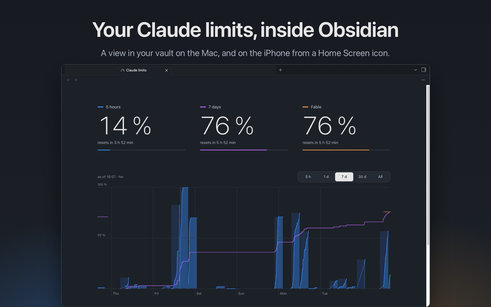

# claude-limits for Obsidian

**Your Claude plan limits, right where your notes are.** The [claude-limits](https://github.com/Reconnact/claude-limits) page as a view inside Obsidian: the 5-hour window, the weekly limit and the weekly Fable limit, with their history. On the Mac, and on the iPhone from a Home Screen icon.



- **On your phone.** With `--phone`, your vault's sync carries the page and its data along, so the phone shows what the Mac recorded.
- **One tap away.** A gauge icon in the ribbon, the command `Claude limits: Open`, and the link `obsidian://claude-limits` for a Home Screen icon.
- **Nothing extra to run.** On the Mac the view reads claude-limits' own files and follows every new snapshot. Your vault gets no generated files unless you want the phone.

This is an add-on. [claude-limits](https://github.com/Reconnact/claude-limits) records the limits and draws the page, and brings the menu bar item. Set it up first.

## Setup

Needs [claude-limits](https://github.com/Reconnact/claude-limits) set up on the Mac, Obsidian, and `jq`.

```sh
git clone https://github.com/Reconnact/claude-limits-obsidian.git ~/claude-limits-obsidian
~/claude-limits-obsidian/install "<path to your vault>"
```

Then restart Obsidian. Under Settings → Community plugins, turn on *Claude limits*.

`install` takes these options:

- `--repo <path>`: where claude-limits is cloned, default `~/claude-limits`
- `--phone`: also copy the page and its data into the vault after every Claude Code turn, for the phone
- `--folder <folder>`: the vault folder for that copy, default `claude-limits`

Run it again at any time, with the same options: without `--phone` it removes the copy hook again. With several vaults, run it once per vault.

### What `install` changes

- copies the plugin into `<vault>/.obsidian/plugins/claude-limits/`, with the clone and the data folder in its `data.json`, and adds it to the vault's plugin list
- with `--phone`, adds a `Stop` hook to `~/.claude/settings.json` and keeps a backup in `settings.json.bak`

## How it works

- on the Mac, the plugin reads the page from the claude-limits clone and the data from `/Users/Shared/claude-limits` (or `CLAUDE_LIMITS_DIR`), and redraws when a file there changes, whichever macOS account wrote it
- Obsidian blocks scripts that an iframe loads from `app://`, so the plugin builds the page into one `srcdoc`, scripts inline
- with `--phone`, after every Claude Code turn the hook runs `copy`. It puts the page and the data files into the vault folder, each only when newer. It also updates the plugin. The vault's sync moves the folder to the phone, and the phone reads it from there

## On the phone

1. On the Mac, run `install` with `--phone`.
2. The vault has to reach the phone, either way works:
   - **Obsidian Sync:** on the phone, under Settings → Sync, turn on *Installed community plugins*, *Active community plugin list*, and under Selective sync *Other types*. Without *Other types* the `.html` and `.js` files never arrive, and the view stays dark
   - **iCloud Drive:** a vault in `iCloud Drive/Obsidian` brings everything along
3. In Obsidian on the phone, under Settings → Community plugins: turn off restricted mode, then turn on *Claude limits*.
4. A Home Screen icon: in the Shortcuts app, make a new shortcut with the action *Open URLs* and the URL `obsidian://claude-limits`. With several vaults, use `obsidian://claude-limits?vault=<vault name>`. Then Share → *Add to Home Screen*.

The page on the phone is as new as the last Claude Code turn on the Mac, plus the time sync takes.

## Updates

```sh
git -C ~/claude-limits-obsidian pull
```

Then run `install` again with the same options, and restart Obsidian. With `--phone`, the next turn copies the new plugin into the vault anyway.

## Uninstall

- with `--phone`: remove the `Stop` hook that runs `claude-limits-obsidian/copy` from `~/.claude/settings.json`, and delete the vault folder
- delete `<vault>/.obsidian/plugins/claude-limits/`

## Test

```sh
make test
```

Needs `jq`, `node` and a claude-limits clone (`CLAUDE_LIMITS_REPO`, default `~/claude-limits`).

## License

MIT
